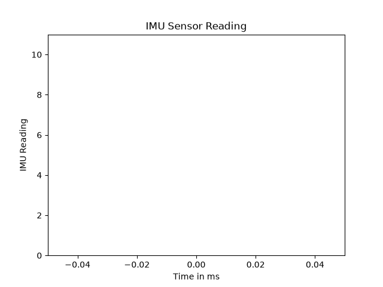
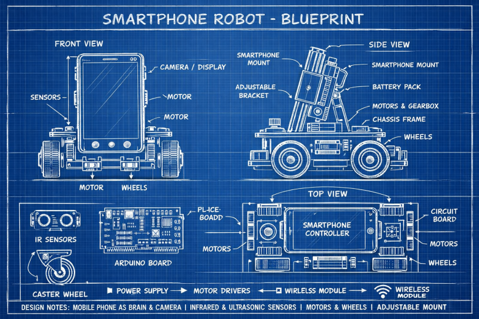
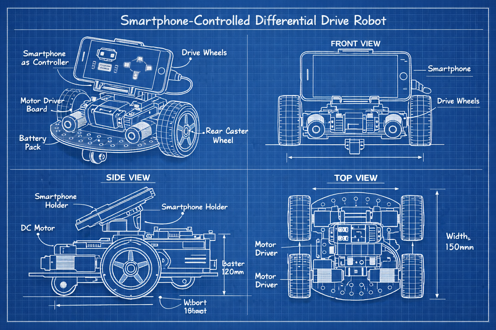
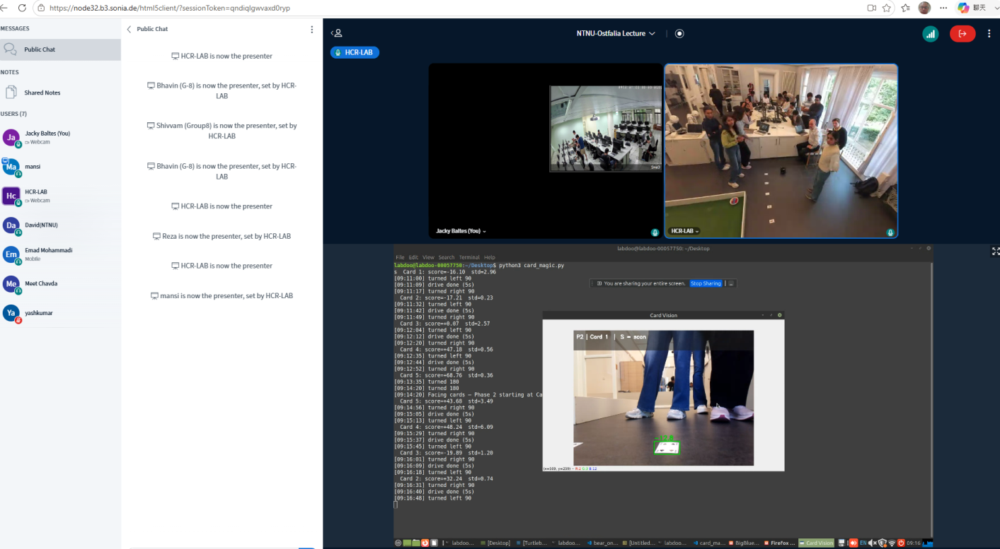
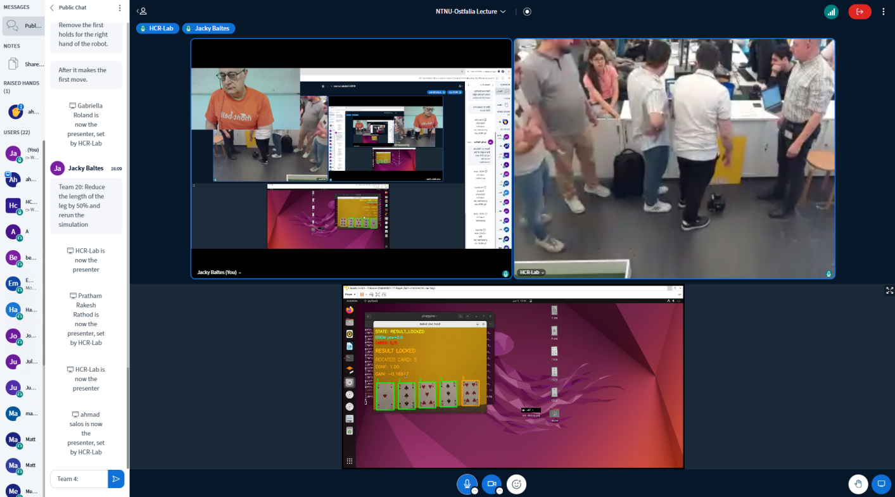
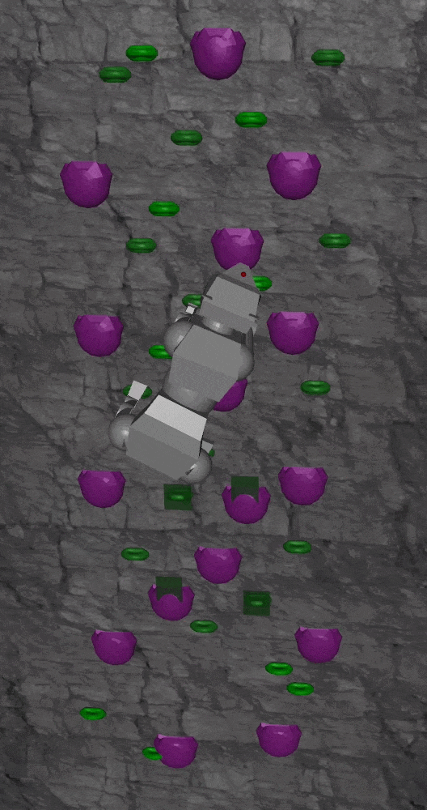
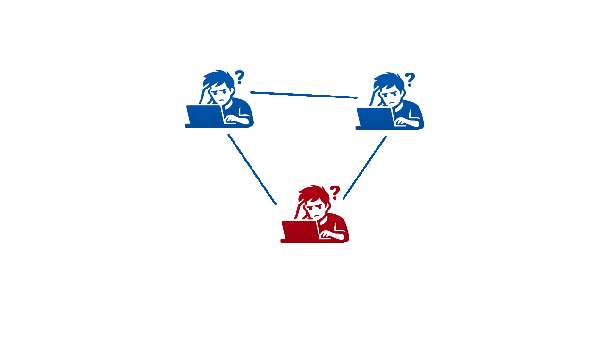
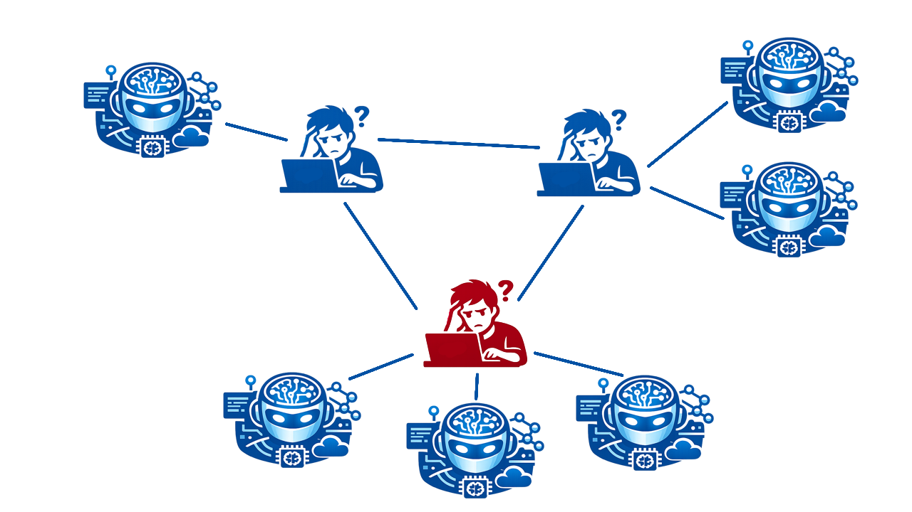
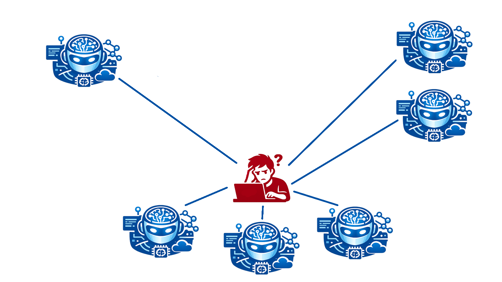

---
# try also 'default' to start simple
theme:
  default
  # basically the text
sans: Robot
# use with `font-serif` css class from UnoCSS
serif: Robot Slab
# for code blocks, inline code, etc.
mono: Fira Code

# random image from a curated Unsplash collection by Anthony
# like them? see https://unsplash.com/collections/94734566/slidev

# some information about your slides (markdown enabled)
title: Teaching Support for Foundational Models and Intelligent Robotics
info: |
  ## Teaching Improvement Grant 2026
  NTNU, Taiwan
  2026-06-16
# apply UnoCSS classes to the current slide
class: text-center
# https://sli.dev/features/drawing
drawings:
  persist: false
# slide transition: https://sli.dev/guide/animations.html#slide-transitions
transition: fade-out
# enable Comark Syntax: https://comark.dev/syntax/markdown
comark: true
# duration of the presentation
duration: 12min
# aspect ratio for the slides
aspectRatio: 16/9
# real width of the canvas, unit in px
canvasWidth: 1280
---

# Teaching Support for Foundational Models and Intelligent Robotics

## Jacky Baltes <[jacky.baltes@ntnu.edu.tw]>
## 2026-06-16

  Press Space for next page <carbon:arrow-right />

  <button @click="$slidev.nav.openInEditor()" title="Open in Editor" class="slidev-icon-btn">
    <carbon:edit />
  </button>
  <a href="https://github.com/bgwessel16/TeachingImprovementGrant-2026" target="_blank" class="slidev-icon-btn">
    <carbon:logo-github />
  </a>

<!--
The last comment block of each slide will be treated as slide notes. It will be visible and editable in Presenter Mode along with the slide. [Read more in the docs](https://sli.dev/guide/syntax.html#notes)
-->

---
transition: fade-out
---

# Motivation
##

Introduce students to modern AI approaches in intelligent robotics. Small language models for reasoning.

Use of modern AI in the classroom

Global virtual classroom (GVC) to build international network

Assessment in the age of AI

---
transition: fade-out
layout: two-cols
---

# Modern AI for Intelligent Robotics
##

::left::
4GB models can run on off the shelf hardware (Microsoft Phi-4.5)

These models lack factual knowledge (height of Taipei 101)

Can still reason, logic, etc.

Prompt: Watch the IMU sensor and trigger emergency stop if it is unusual.

::right::

---
transition: fade-out
---

# Modern AI in Design
##

Vibe Coding: intelligent IDE built into most systems

Generative AI: Students used generative AI for design ideas for the simple robot

| Robot Design Group 1 | Robot Design Group 3 |
|---------|---------|
|  |  |

---
transition: fade-out
---

# Modern AI in the Classroom
##

Global Virtual Classroom: Joint work between students from Taiwan (NTNU) and Germany (Ostfalia Uni)

TA support, new cameras and HDs for recorded joint lectures

| Group 1 | Group 2 |
|---------|---------|
|  |  |

---
transition: fade-out
---

# Hackathon
##

Hackathon: 2 week project - Rock climbing humanoid robot

| Robot Design Group 1 | Robot Design Group 3 |
|---------|---------|
|  |  |
---
transition: fade-out
---

# Modern AI and Assessment
##

Students use LLMs extensively during projects and assignments

2025 was the watershed year. My exams don't work anymore
- Uni Cologne (Germany) has gotten rid of B.Sc. thesis
- Robotics in Education (RiE) 2026, Wolfenbuettel, Germany

Final Exam: 
  - Project. Implement algorithms from 3 research papers
  - Oral exam - based on their implementation
---
transition: fade-out
layout: two-cols
---
# Modern AI and Group Projects
##

::left::
Integral part of projects. Working with peers.

Larger scale project

Enhances social skills

Friction - Language, time zone, working styles

::right::

---
transition: fade-out
layout: two-cols
---
# Modern AI and Group Projects
##

::left::

In 2026 - students use AI

One or more agents

::right::

---
transition: fade-out
layout: two-cols
---
# Modern AI and Group Projects
##

::left::

Easy to replace team members

Destroys diversity, equity, and inclusion

::right::

---
transition: fade-out
---

# Conclusion
##

Difference in class sizes (80 students in Germany, 20 students in Taiwan)

AI replaces team members

Bad audio quality in German lab

New shorter term projects to break the ice

